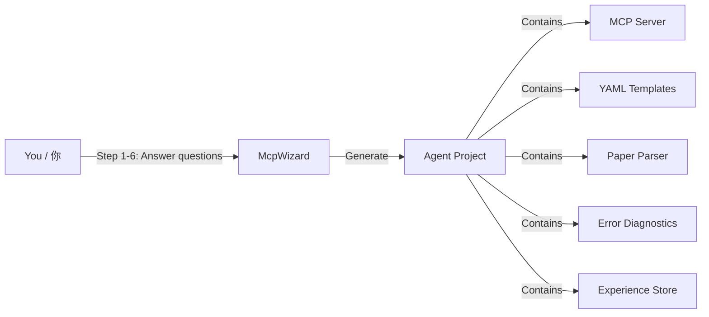

# sim-agent-platform — Universal Simulation Agent Platform
# sim-agent-platform — 通用仿真 Agent 平台

[](https://www.python.org/)
[](LICENSE)
[](https://modelcontextprotocol.io/)
[](https://github.com/openai/codex)

> **One platform. Any simulation software.** / **一个平台。任意仿真软件。**
>
> Describe your software — the wizard generates a complete AI Agent for it.
> 描述你的软件 — 向导生成一个完整的 AI Agent。

---

## The Problem / 问题

Every simulation software needs its own AI agent. Without this platform:
每个仿真软件都需要自己的 AI Agent。没有这个平台：

- Build MCP server from scratch? → 1000+ lines of boilerplate / 1000+ 行样板代码
- Paper-to-simulation? → Write custom parser for each software / 为每个软件写解析器
- Error auto-diagnosis? → Manually catalog error patterns / 手动整理错误模式
- Experience learning? → Build from zero every time / 每次都从零搭建

## The Solution / 解决方案

**6-step guided wizard → Complete Agent** / **6 步引导式向导 → 完整 Agent**



---

## Quick Example / 快速示例

### Creating an ANSYS Agent (with Codex) / 创建 ANSYS Agent（在 Codex 中）

```
User / 用户:
  "用 sim-agent-platform 为 ANSYS 创建一个 Agent"

Codex (guided by SKILL.md) / Codex（由 SKILL.md 引导）:
  --- Step 1/6: Software Identity / 软件身份 ---
  Q: What is the simulation software called?
  A: ANSYS Mechanical

  Q: Does it have a Python SDK?
  A: pyansys, pip install pyansys

  Q: Connection mode?
  A: 1 (Python SDK)

  --- Step 2/6: Physics Domains / 物理领域 ---
  Q: How many physics domains?
  A: 3 — structural, thermal, electromagnetic

  [For each domain, asks about interfaces and study types]

  --- Step 3/6: Error Patterns / 错误模式 ---
  Q: Common solver errors?
  A: 1. rigid body motion → insufficient constraints
     2. negative Jacobian → bad mesh
     3. non-convergence → refine mesh
     ...

  --- Step 4/6: Template Seeds / 模板播种 ---
  Q: Typical simulation workflows?
  A: 1. Cantilever beam → structural
     2. Heat sink → thermal
     3. Modal analysis → structural

  --- Step 5/6: Paper Keywords / 论文关键词 ---
  Q: Keywords for each domain?
  A: structural: [stress, von Mises, FEA, displacement...]
     thermal: [heat flux, temperature, Nusselt...]

  --- Step 6/6: MCP Tools / MCP 工具 ---
  Q: Core operations?
  A: create_geometry, assign_material, apply_load, mesh, solve, get_result

  ✅ All 6 steps complete. Generating files...
  Created: ansys-agent/src/mcp_server/server.py
  Created: ansys-agent/templates/structural/cantilever_beam.yaml
  Created: ansys-agent/templates/thermal/heat_sink.yaml
  ...
  Created: ansys-agent/skills/SKILL.md

  Done! Say "Simulate a cantilever beam" to test.
```

---

## Architecture / 架构

```
sim-agent-platform/                         # THIS PROJECT — Universal skeleton
                                            # 本项目 — 通用骨架
├── src/sim_agent/
│   ├── core/
│   │   ├── template_store.py               # Universal YAML template system
│   │   │                                   # 通用 YAML 模板系统
│   │   └── experience_store.py             # Universal correction memory
│   │                                       # 通用纠错记忆
│   ├── adapters/
│   │   ├── mcp_wizard.py                   # ★ Guided setup wizard / 引导式配置向导
│   │   ├── base_parser.py                  # Pluggable paper parser / 可插拔论文解析器
│   │   └── base_diagnostics.py             # Pluggable diagnostics / 可插拔诊断器
│   └── skills/
│       └── SKILL.md                        # Codex skill for the wizard
│
├── docs/
│   └── mcp_server_template.py              # Minimal MCP server template
│                                           # MCP Server 最小模板
└── examples/                               # Example agents / 示例 Agent
    └── comsol/                             # COMSOL Agent (built with this platform)

comsol-agent/                               # COMSOL-specific / COMSOL 专属
ansys-agent/                                # ANSYS-specific / ANSYS 专属
lumerical-agent/                            # Lumerical-specific / Lumerical 专属
your-agent/                                 # YOUR software / 你的软件
    ↓                                       # Each generated by the wizard
    ↓                                       # 每个都由向导生成
```

## What Gets Generated / 生成了什么

For each software, the wizard generates / 为每个软件生成：

| File / 文件 | Purpose / 用途 | Lines / 行数 |
|------------|---------------|------------|
| `src/mcp_server/server.py` | MCP Server (from template) / MCP 服务器 | ~100 |
| `src/agent_config.py` | Software-specific config / 软件专属配置 | ~80 |
| `templates/{domain}/*.yaml` | 3-5 seed templates / 3-5 个种子模板 | ~50 each |
| `skills/SKILL.md` | Codex skill for the generated agent | ~60 |
| `README.md` | Project README | ~80 |
| `pyproject.toml` | Python config | ~15 |

**Total: ~500 lines vs ~2000+ lines if built from scratch.**
**总计：约 500 行 vs 从零搭建需 2000+ 行。**

---

## Module Reusability / 模块复用率

| Module / 模块 | Reusability / 复用率 | Customization / 定制方式 |
|--------------|---------------------|------------------------|
| `template_store.py` | 100% | Just swap YAML files / 只换 YAML 文件 |
| `experience_store.py` | 100% | Nothing to change / 无需改动 |
| `base_parser.py` | 80% | Override keyword dicts / 覆盖关键词词典 |
| `base_diagnostics.py` | 30% | Override error patterns / 覆盖错误模式 |
| `mcp_wizard.py` | 100% | No change — drives all software / 不变 — 驱动所有软件 |

---

## Installation / 安装

```bash
# Clone and install the platform
git clone https://github.com/fllowzle/sim-agent-platform.git
cd sim-agent-platform
pip install -e .

# Use with Codex: load skills/SKILL.md as a Codex Skill
# 在 Codex 中使用：将 skills/SKILL.md 加载为 Codex Skill
```

## Usage / 使用方式

### Method 1: With Codex (Recommended) / 方式 1：Codex（推荐）

1. Load `src/sim_agent/skills/SKILL.md` as a Codex Skill
2. Say: "Create an agent for [your software]"
3. Answer the 6 wizard questions
4. Codex generates the entire agent project
5. Register the new MCP server in Codex config
6. Start simulating!

### Method 2: Python API / 方式 2：Python API

```python
from sim_agent.adapters.mcp_wizard import McpWizard, create_profile_quick

# Quick mode
profile = create_profile_quick(
    name="ANSYS Mechanical",
    python_sdk="pyansys",
    sdk_install="pip install pyansys",
)
profile.domains = [
    {"name": "structural", "label": "Structure Mechanics",
     "physics_interfaces": ["StaticStructural"],
     "study_types": ["stationary", "transient"]},
]

# Full interactive mode
wizard = McpWizard()
q = wizard.get_next_question()
while q:
    print(f"\n{q['title']}")
    print(q['question']['ask'])
    answer = input("> ")
    wizard.answer(q['step_id'], q['question']['id'], answer)
    q = wizard.get_next_question()

# Generate
plan = wizard.generate_file_plan()
print(f"Files to create: {len(plan['files_to_create'])}")
```

---

## Relationship to COMSOL Agent / 与 COMSOL Agent 的关系

```
sim-agent-platform  ← 通用骨架（本项目）
       |
       +--- examples/comsol/  ← COMSOL Agent（comsol-agent代码库独立维护）
       |                        包含 COMSOL 专属的 SKILL.md、Wu-Hu 模板等
       |
       +--- [your software]  ← 你的 Agent（向导生成）
```

The [COMSOL Agent](https://github.com/fllowzle/comsol-agent) is the first complete example built with this platform.

---

## License / 许可证

MIT

---

> **"Give me 6 answers about your software, and I'll give you a complete AI Agent."**
> **"告诉我关于你软件的 6 个答案，我给你一个完整的 AI Agent。"**
