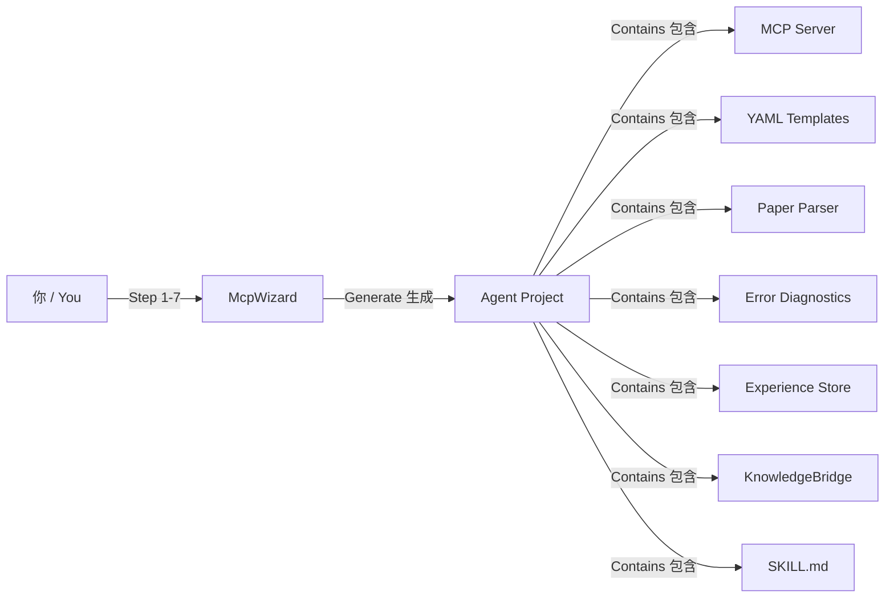

# sim-agent-platform — Universal Simulation Agent Platform
# sim-agent-platform — 通用仿真 Agent 平台

[](https://www.python.org/)
[](LICENSE)
[](https://modelcontextprotocol.io/)
[](https://github.com/openai/codex)

> **One platform. Any simulation software.**
> **一个平台。任意仿真软件。**
>
> Describe your software — the wizard generates a complete AI Agent for it.
> 描述你的软件 — 向导自动生成完整的 AI Agent。

---

## 目录 / Table of Contents

- [The Problem / 解决什么问题](#the-problem--解决什么问题)
- [The Solution / 怎么解决](#the-solution--怎么解决)
- [快速示例 / Quick Example](#快速示例--quick-example)
- [Architecture / 架构](#architecture--架构)
- [核心模块 / Core Modules](#核心模块--core-modules)
  - [1. McpWizard 七步向导](#1-mcpwizard-七步向导-)
  - [2. KnowledgeBridge 知识桥](#2-knowledgebridge-知识桥-)
  - [3. ModelLearner 模型学习](#3-modellearner-模型学习-)
  - [4. BasePaperParser 论文解析器](#4-basepaperparser-论文解析器)
  - [5. BaseDiagnostics 诊断器](#5-basediagnostics-诊断器)
- [模块复用率 / Module Reusability](#模块复用率--module-reusability)
- [安装与使用 / Installation & Usage](#安装与使用--installation--usage)
- [与 COMSOL Agent 的关系](#与-comsol-agent-的关系)
- [路线图 / Roadmap](#路线图--roadmap)
- [许可证 / License](#许可证--license)

---

## The Problem / 解决什么问题

每个仿真软件都需要自己的 AI Agent。没有这个平台，你需要：

| 任务 / Task | 传统方式 / Traditional | 本平台 / This Platform |
|:--|:--|:--|
| 搭建 MCP Server | 1000+ 行样板代码 | 自动生成 |
| 论文 → 仿真 | 为每个软件手写解析器 | 可插拔基类，覆盖关键词即可 |
| 错误自动诊断 | 手动整理错误模式库 | 可插拔基类，覆盖错误列表即可 |
| 经验学习 | 每次从零搭建 | 通用 ExperienceStore，开箱即用 |
| 知识库集成 | 手动索引文档 | 通用 KnowledgeBridge，配置路径即可 |
| 从已有模型学习 | 不可行 | ModelLearner，自动提取模板 |

---

## The Solution / 怎么解决

**7 步向导 → 完整 Agent**（约 500 行生成代码 vs 从零搭建 2000+ 行）



---

## 快速示例 / Quick Example

### 用 Codex 创建 ANSYS Agent / Creating an ANSYS Agent

```
用户: "用 sim-agent-platform 为 ANSYS 创建一个 Agent"

Codex（由 SKILL.md 引导）:
  ── Step 1/7: Software Identity / 软件身份 ──
  Q: What is the simulation software called?
  A: ANSYS Mechanical

  Q: Does it have a Python SDK?
  A: pyansys, pip install pyansys

  Q: Connection mode?
  A: 1 (Python SDK)

  ── Step 2/7: Physics Domains / 物理领域 ──
  Q: How many physics domains?
  A: 3 — structural, thermal, electromagnetic

  [对每个领域，询问物理接口和求解类型]

  ── Step 3/7: Error Patterns / 错误模式 ──
  Q: Common solver errors?
  A: 1. rigid body motion → insufficient constraints
     2. negative Jacobian → bad mesh
     3. non-convergence → refine mesh
     ...

  ── Step 4/7: Template Seeds / 模板种子 ──
  Q: Typical simulation workflows?
  A: 1. Cantilever beam → structural
     2. Heat sink → thermal
     3. Modal analysis → structural

  ── Step 5/7: Paper Keywords / 论文关键词 ──
  Q: Keywords for each domain?
  A: structural: [stress, von Mises, FEA, displacement...]
     thermal: [heat flux, temperature, Nusselt...]

  ── Step 6/7: MCP Tools / MCP 工具 ──
  Q: Core operations?
  A: create_geometry, assign_material, apply_load, mesh, solve, get_result

  ── Step 7/7: Knowledge Base / 知识库配置 ──
  Q: Knowledge sources?
  A: docs/guides/, docs/pdf/, physics_topics.yaml
     PDF relevance: structural→[Structural_Analysis, Material_Models]
                   thermal→[Thermal_Analysis, CFD]

  ✅ All 7 steps complete. Generating files...
  Created: ansys-agent/src/mcp_server/server.py
  Created: ansys-agent/templates/structural/cantilever_beam.yaml
  Created: ansys-agent/templates/thermal/heat_sink.yaml
  ...
  Created: ansys-agent/skills/SKILL.md

  Done! Say "Simulate a cantilever beam" to test.
```

---

## Architecture / 架构

```
sim-agent-platform/                         # 本项目 — Universal skeleton / 通用骨架
│
├── src/sim_agent/
│   ├── core/                               # ★ 100% 软件无关 / Software-Agnostic
│   │   ├── template_store.py               #   Universal YAML template system 通用模板系统
│   │   └── experience_store.py             #   Universal correction memory 通用纠错记忆
│   │
│   ├── adapters/                           # ★ 可插拔适配器 / Pluggable Adapters
│   │   ├── mcp_wizard.py                  #   ★ 7-step guided setup wizard 七步向导
│   │   ├── knowledge_bridge.py            #   ★ Universal multi-source KB 通用知识桥
│   │   ├── model_learner.py               #   ★ Extract templates from model files 模型学习
│   │   ├── base_parser.py                 #   Pluggable paper parser 可插拔论文解析器
│   │   └── base_diagnostics.py            #   Pluggable error diagnosis 可插拔诊断器
│   │
│   └── skills/
│       └── SKILL.md                        # Codex skill for the wizard
│
├── docs/
│   └── mcp_server_template.py             # Minimal MCP server template / 最小 MCP Server 模板
│
└── tests/
    ├── test_all.py                         # Core module tests (6/6 PASS)
    └── test_wizard.py                      # Wizard integration tests
```

---

## 核心模块 / Core Modules

### 1. McpWizard 七步向导 ★

引导式配置，逐步收集软件信息，自动生成完整 Agent 项目。

**七步流程 / 7 Steps：**

| Step | 收集内容 / What | 示例输出 / Example Output |
|:--:|------|------|
| 1 | **软件身份** / Software Identity | 名称、Python SDK、连接方式 |
| 2 | **物理领域** / Physics Domains | 各领域的物理接口、求解类型 |
| 3 | **错误模式** / Error Patterns | 常见错误 → 修复建议映射 |
| 4 | **模板种子** / Template Seeds | 3-5 个典型仿真工作流 YAML |
| 5 | **论文关键词** / Paper Keywords | 各领域的论文高频词汇 |
| 6 | **MCP 工具** / MCP Tools | 核心操作（geometry, mesh, solve…） |
| 7 | **知识库配置** / Knowledge Base | 文档路径、PDF 模块映射、向量搜索配置 |

```python
from sim_agent.adapters.mcp_wizard import McpWizard, create_profile_quick

# 快速模式 / Quick Mode
profile = create_profile_quick(
    name="ANSYS Mechanical",
    python_sdk="pyansys",
    sdk_install="pip install pyansys",
)
profile.domains = [
    {"name": "structural", "label": "结构力学",
     "physics_interfaces": ["StaticStructural"],
     "study_types": ["stationary", "transient"]},
]

# 完整交互模式 / Full Interactive Mode
wizard = McpWizard()
q = wizard.get_next_question()
while q:
    print(f"\n{q['title']}")
    print(q['question']['ask'])
    answer = input("> ")
    wizard.answer(q['step_id'], q['question']['id'], answer)
    q = wizard.get_next_question()

# 生成完整项目
plan = wizard.generate_file_plan()
print(f"Files to create: {len(plan['files_to_create'])}")
# → 生成：MCP Server、YAML 模板、论文解析器、诊断器、经验库、SKILL.md
```

**生成文件清单 / Generated Files：**

| 文件 / File | 内容 / Content | 预估行数 |
|:--|:--|:--:|
| `src/mcp_server/server.py` | MCP Server with tools | ~150 |
| `templates/{domain}/*.yaml` | 3-5 个种子模板 | ~50 each |
| `src/parser/paper_parser.py` | 论文解析器 | ~80 |
| `src/diagnostics/solver_diagnostics.py` | 错误诊断器 | ~60 |
| `src/knowledge/knowledge_bridge.py` | 知识桥（带配置） | ~120 |
| `skills/SKILL.md` | Codex 技能文件 | ~60 |
| `README.md` | 项目说明 | ~80 |
| `pyproject.toml` | Python 项目配置 | ~15 |

**总计约 500 行，从零搭建需 2000+ 行。**

### 2. KnowledgeBridge 知识桥 ★

每个生成的 Agent 都自带通用 KnowledgeBridge，统一管理多源知识：

| 优先级 | 来源 / Source | 复用率 | 配置方式 / How to Configure |
|:--:|------|:--:|:--|
| 1 | **ExperienceStore** 经验库 | 100% | 无需配置，自动继承 |
| 2 | **TemplateStore** 模板陷阱 | 100% | 无需配置，自动继承 |
| 3 | **Embedded Markdown** 嵌入式指南 | 可插拔 | 指定 `GUIDES_DIR` 路径 |
| 4 | **Physics Topic Guides** 物理专题 | 可插拔 | 提供 `physics_topics.yaml` |
| 5 | **PDF Vector Search** PDF 语义搜索 | 可配置 | 指定 `PDF_MODULES_DIR` + `PDF_RELEVANCE_MAP` |

```python
from sim_agent.adapters.knowledge_bridge import KnowledgeBridge

# 为你的软件配置 KnowledgeBridge
class MyBridge(KnowledgeBridge):
    GUIDES_DIR = Path("./docs/guides")           # Markdown 参考文档
    PDF_MODULES_DIR = Path("./docs/pdf")         # PDF 参考手册
    PDF_RELEVANCE_MAP = {                         # 领域 → PDF 映射
        "structural": ["Structural_Analysis", "Material_Models"],
        "thermal": ["Thermal_Analysis", "CFD"],
    }
    TOPICS_CONFIG = Path("./physics_topics.yaml") # 物理专题配置

kb = MyBridge()
# 综合查询
result = kb.query("How to set up fixed support?", domain="structural")
# → 按优先级返回：经验库 → 模板注释 → Markdown 指南 → 物理专题 → PDF 语义搜索

# 查看知识库状态
status = kb.knowledge_status()
```

### 3. ModelLearner 模型学习 ★

自动从已有的模型文件中提取仿真模板，支持两种格式：

| 格式 / Format | 方法 / Method | 原理 / How |
|:--|:--|:--|
| `.mph` (COMSOL) | `learn_from_mph()` | 通过 mph 库读取模型树，提取参数 |
| `.py` (Python 脚本) | `learn_from_python()` | AST 解析 mph API 调用链 |
| 可扩展格式 | 继承 `ModelLearner` 基类 | 覆盖 `_extract_*` 方法即可 |

```python
from sim_agent.adapters.model_learner import ModelLearner

learner = ModelLearner()

# 从模型文件学习
learner.learn_from_file("my_model.mph", domain="structural")

# 从 Python 脚本学习
learner.learn_from_file("cantilever_beam.py", domain="structural")

# 学到的模板自动存入 TemplateStore
# templates/structural/my_model.yaml
# templates/structural/cantilever_beam.yaml
```

**扩展方式 / How to Extend：**

```python
class MySoftwareLearner(ModelLearner):
    def _extract_geometry(self, model_obj):
        # 你的软件特定的几何提取逻辑
        pass

    def _extract_materials(self, model_obj):
        # 你的软件特定的材料提取逻辑
        pass
```

### 4. BasePaperParser 论文解析器

可插拔的论文解析基类，覆盖关键词词典即可适配新领域：

```python
from sim_agent.adapters.base_parser import BasePaperParser

class MyParser(BasePaperParser):
    DOMAIN_KEYWORDS = {
        "structural": ["stress", "von Mises", "FEA", "finite element",
                       "displacement", "strain", "elastic modulus"],
        "thermal": ["heat flux", "temperature", "Nusselt", "convection",
                    "conduction", "thermal conductivity"],
    }
    STUDY_KEYWORDS = {
        "stationary": ["static", "steady", "equilibrium"],
        "transient": ["dynamic", "time-dependent", "transient"],
        "modal": ["eigenfrequency", "mode shape", "natural frequency"],
    }

parser = MyParser()
info = parser.parse_pdf("paper.pdf")
print(info.domain)    # → "structural"
print(info.study)     # → "stationary"
```

### 5. BaseDiagnostics 诊断器

可插拔的错误诊断基类，覆盖错误模式即可适配新软件：

```python
from sim_agent.adapters.base_diagnostics import BaseDiagnostics

class MyDiagnostics(BaseDiagnostics):
    ERROR_PATTERNS = [
        {
            "pattern": "rigid body motion",
            "cause": "Insufficient constraints",
            "fix": "Add boundary conditions to constrain all 6 DOFs",
        },
        {
            "pattern": "negative Jacobian",
            "cause": "Poor mesh quality",
            "fix": "Refine mesh or use mapped meshing",
        },
        {
            "pattern": "non-convergence",
            "cause": "Solver settings too strict",
            "fix": "Increase iteration limit or relax tolerance",
        },
    ]

diag = MyDiagnostics()
result = diag.diagnose("Solver error: rigid body motion detected", domain="structural")
# → cause: "Insufficient constraints"
# → fix: "Add boundary conditions to constrain all 6 DOFs"
```

---

## 模块复用率 / Module Reusability

| 模块 / Module | 复用率 | 适配方式 / How to Adapt | 说明 / Notes |
|:--|:--:|:--|:--|
| `core/template_store.py` | **100%** | 换 YAML 文件 | YAML 格式通用 |
| `core/experience_store.py` | **100%** | 无需改动 | JSON 存储，与软件无关 |
| `adapters/mcp_wizard.py` | **100%** | 无需改动 | 问题模板是通用的 |
| `adapters/model_learner.py` | **Per-software** | 继承并覆盖提取方法 | 文件格式各软件不同 |
| `adapters/knowledge_bridge.py` | **80%** | 配置路径 + PDF 映射 | 基类逻辑通用 |
| `adapters/base_parser.py` | **80%** | 覆盖关键词词典 | 领域词不同 |
| `adapters/base_diagnostics.py` | **30%** | 覆盖错误模式列表 | 每种软件错误不同 |
| `skills/SKILL.md` | **90%** | 替换软件名称 | 技能结构通用 |

---

## 安装与使用 / Installation & Usage

### 安装 / Installation

```bash
# 克隆平台
git clone https://github.com/fllowzle/sim-agent-platform.git
cd sim-agent-platform
pip install -e .

# 运行测试
python tests/test_all.py
# → 6/6 PASS
```

### 使用方式 1：Codex 引导（推荐）

1. 在 Codex 中加载 `src/sim_agent/skills/SKILL.md` 作为技能
2. 说：**"用 sim-agent-platform 为 [你的软件] 创建一个 Agent"**
3. 回答 7 步向导问题
4. Codex 自动生成整个 Agent 项目
5. 将新的 MCP Server 注册到 Codex 配置
6. 开始仿真！

### 使用方式 2：Python API

```python
from sim_agent.adapters.mcp_wizard import McpWizard

wizard = McpWizard()
# ... 交互式回答 7 步问题 ...
plan = wizard.generate_file_plan()
# plan 包含所有需要生成的文件及其内容
```

---

## 与 COMSOL Agent 的关系

```
sim-agent-platform   → 通用骨架（本项目）
    │
    ├── examples/comsol-agent/   → COMSOL Agent（独立维护）
    │    包含 COMSOL 专属的 SKILL.md、Wu-Hu 模板、COMSOL 论文解析器
    │
    └── [你的软件]   → 你的 Agent（向导生成）
        包含你的软件的 YAML 模板、论文关键词、错误模式
```

[COMSOL Agent](https://github.com/fllowzle/comsol-agent) 是用本平台构建的第一个完整示例。

---

## 路线图 / Roadmap

- [x] 通用模板系统（TemplateStore）
- [x] 通用经验库（ExperienceStore）
- [x] 七步向导（McpWizard）
- [x] 可插拔论文解析器（BasePaperParser）
- [x] 可插拔诊断器（BaseDiagnostics）
- [x] 通用 KnowledgeBridge（多源知识统一查询）
- [x] ModelLearner（从 .mph/.py 提取模板）
- [x] 完整测试套件（6/6 PASS）
- [x] **全模块已在 Codex 中实际生成过 Agent 并验证可用**
- [ ] 更多软件适配示例（ANSYS, Lumerical, OpenFOAM…）
- [ ] Web UI 向导界面（无需 Codex 也能用）
- [ ] 模板共享社区

---

## 适用于哪些软件？ / Which Software?

**原则上，任何可通过 Python SDK、CLI 或 REST API 驱动的仿真软件都可以：**

| 软件 / Software | Python 接口 | 适用性 |
|:--|:--|:--:|
| COMSOL Multiphysics | mph | ✅ 已实现 |
| ANSYS Mechanical | pyansys | ✅ 可行 |
| Lumerical (FDTD) | lumapi | ✅ 可行 |
| OpenFOAM | subprocess + Python | ✅ 可行 |
| Abaqus | abaqus-python | ✅ 可行 |
| CST Studio Suite | COM/VBA | ⚠️ 需适配 |
| COMSOL with LiveLink MATLAB | matlab-engine | ✅ 可行 |

**没有 Python SDK？** 没关系 — `mcp_server_template.py` 提供了通过 subprocess 或 CLI 调用的通用方案。

---

## 许可证 / License

MIT — 随意使用、修改、分发。

---

> **"Give me 7 answers about your software, and I'll give you a complete AI Agent."**
> **"告诉我关于你软件的 7 个答案，我给你一个完整的 AI Agent。"**
